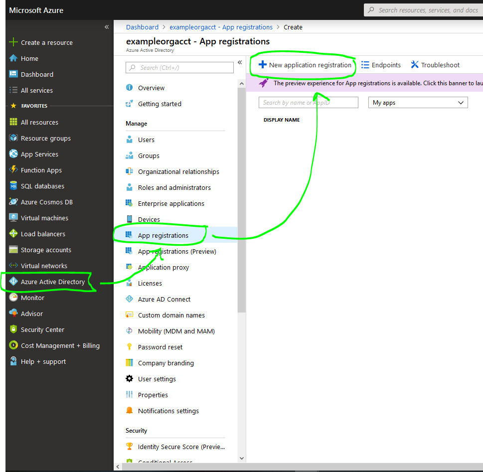

pymsaad
=======================

### Important Note about PartnerCenter: 
With a few changes, `pymsaad` can be used to integrate & authenticate with the [Microsoft PartnerCenter](https://partnercenter.microsoft.com), without having to use the C# SDK.  

Please reach out to rtruxal2020 at outlook.com with any inquiries about getting your organization set up to use the Microsoft PartnerCenter API.

## Overview:
If you're a python dev who integrates with Microsoft applications, you may be aware of how tricky it can be to authenticate with AAD. 
This (poorly named) python package attempts to boil it down to the bare essentials.  

Microsoft describes Python's ADAL (Active Directory Authentication Library) module as a tool that ["makes authentication easier for developers"](https://docs.microsoft.com/en-us/azure/active-directory/develop/active-directory-authentication-libraries)
While ADAL does make things easier, we are authenticating against an organizational tenant. You still need to understand what you are doing to prevent missuse of your application's permission scope. 


  
<br>

### pymsaad has two parts:
#### It's Part Docs _(see `docs/`)_
pymsaad is a guide (with lots of pictures.) It aims simplify the AAD app registration/authentication process, and to make clear exactly what needs to be done, and what you're doing.
#### It's Part Tool _(see `pymsaad/`)_
pymsaad obtains a generic authentication token from AAD using `adal` & saves it locally, allowing any application (not just python apps) to authenticate against your AAD tenant & access the data you specify. 


!!!!!
\<PICTURE OF AAD PORTAL\>
!!!!!
<br>
## Installation:

This package isn't meant to be installed. Follow these steps:
```
git clone https://github.com/rtruxal/pymsaad.git
cd pymsaad
pip install requirements.txt
```
and you're done with installation.

<br>

## Setup:
Now for the tricky part. To keep things secure, the configuration of this application is highly setting up coupled to its corresponding AAD Enterprise Application registration.  
Further, obtaining an adal token without setting up SSL would defeat the purpose of having security controls in the first place.  

Because of this, there's a good ammt of configuration involved. `pymsaad` aims to simplify configuration & registration as much as possible with simple but comprehensive documentation.

## Docs:
#### 1. [Generate Local Certificates for End-to-End Encryption](docs/1-CERTIFICATES.md) 
[content]

#### 2. [Register Your "Enterprise Application" via The Azure Portal](docs/2-APP_REGISTRATION.md)
[content]

#### 3. [Collect Information from https://portal.azure.com Which is Required to Authenticate](docs/3-GATHER_REGISTRATION_INFO.md)
[moar content]

#### 4. [Configure this Flask Application.](docs/4-CONFIGURE_FLASK.md)
[even moar content]

#### 5. [Get & save an auth token.](docs/5-TEST.md)
[the most content]

## Optional Steps:
#### 6. [Set up AAD Token Auto-Renewal.](docs/6-optional-AUTO_RENEW.md)
[content]